# Espejismo

**[🇬🇧 English](README.md) &nbsp;|&nbsp; [🇪🇸 Español](README_ES.md)**

<p>
  
  
  
  
  
  
</p>

A native cross-platform Rust encrypted transport tunnel for public and untrusted
networks. SOCKS5 & HTTP local ingress, X25519 forward secrecy, XChaCha20-Poly1305
encrypted frames, yamux multiplexing, adaptive padding, and client puzzles — all in
safe Rust with no TUN/TAP or system-level dependencies.

Current release: `v0.0.2`.

## Architecture

### System View

```mermaid
flowchart LR
    subgraph Local["espejismo-local"]
        APP["Application"]
        SOCKS["SOCKS5 ingress<br/>TCP CONNECT + UDP ASSOCIATE"]
        HTTP["HTTP proxy ingress<br/>CONNECT + absolute-form HTTP"]
        AUTH["Optional local auth"]
        YMUX_C["yamux client session<br/>logical streams"]
        ENC_C["Encrypted transport adapter"]
    end

    subgraph Wire["Public TCP connection"]
        FLOW["AEAD-protected byte stream<br/>standard or stealth profile"]
    end

    subgraph Remote["espejismo-remote"]
        PROBE["Probe guard<br/>HTTP fallback or silent tarpit"]
        HS["Handshake verifier<br/>HMAC + X25519 + puzzle + replay cache"]
        ENC_R["Encrypted transport adapter"]
        YMUX_R["yamux server session"]
        REQ["Tunnel request parser"]
        POLICY["Egress policy<br/>host + port ACL + SOCKS5 chain"]
        DEST["TCP / UDP destination"]
    end

    APP --> SOCKS --> AUTH --> YMUX_C
    APP --> HTTP --> AUTH
    YMUX_C --> ENC_C --> FLOW --> PROBE --> HS --> ENC_R --> YMUX_R
    YMUX_R --> REQ --> POLICY --> DEST
```



The important layering detail is that yamux owns logical streams, while
`spawn_frame_transport` provides yamux with a normal `AsyncRead + AsyncWrite`
object backed by encrypted frames. Local proxy requests become yamux streams;
the physical socket carries only the encrypted transport.

### Protocol Stack

```text
Application traffic
  -> SOCKS5 / HTTP proxy parser
  -> optional local proxy auth
  -> yamux logical stream
  -> encrypted frame transport
  -> TCP socket
  -> remote handshake / replay / probe defenses
  -> yamux stream handler
  -> egress policy
  -> TCP connect or one-shot UDP relay
```

### Handshake

Standard mode starts with a variable-length authenticated client hello:

```text
[ HMAC-SHA256 32 ][ UTC timestamp 8 ][ nonce 24 ][ X25519 public key 32 ]
[ protocol version 2 ][ capabilities 8 ][ puzzle nonce 8 ]
[ padding length 2 ][ padding 0..N ]
```

The client solves a bounded SHA-256 leading-zero puzzle over the body before
computing the HMAC. The remote verifies the puzzle, checks timestamp skew,
validates the HMAC in constant time, and records the ephemeral public key in a
bounded replay cache. Session keys are derived with X25519 and HKDF-SHA256.

When `profile = "stealth"`, the hello exchange is wrapped in two fixed-size
blocks that match `shared.stealth.frame_size`. The block payload is masked with
an HMAC-derived XOR stream and random padding, so the handshake does not expose
the plain-mode hello length or the fixed-size server hello.

### Frame Transport

Standard profiles use masked length-prefixed AEAD frames:

```text
[ masked ciphertext length 4 ][ XChaCha20-Poly1305(type || payload) ]
```

`low_latency`, `balanced`, and `high_entropy` tune chunk randomization, jitter,
and adaptive padding around that standard frame format.

Stealth mode uses fixed-size AEAD frames without a length header:

```text
[ XChaCha20-Poly1305 ciphertext exactly shared.stealth.frame_size bytes ]

plaintext before encryption:
[ type 1 ][ payload_len 2 ][ payload ][ random padding to fixed size ]
```

The upload pump sends a short random padding warmup after the stealth handshake,
then writes data or padding frames on a paced schedule. If no application data
is queued, the idle cadence decays from the base `tick_ms` toward slower
heartbeat-like intervals; real data resets the cadence. A small pre-write jitter
is applied so data and padding frames do not have perfectly identical scheduler
behavior.

### Probe And Fallback Behavior

Unknown or invalid peers receive no protocol error. Depending on remote config,
they are either held in a bounded silent tarpit or, for HTTP-looking probes,
routed to a configured fallback upstream. If no upstream is configured, the
built-in fallback returns a small HTTP 200 response with dynamic `Date`,
`Last-Modified`, `ETag`, `Content-Length`, `Connection`, and `Server` headers.
A real Nginx/Caddy upstream is still the preferred production fallback because
it inherits a complete and natural web-server fingerprint.

### What Stealth Helps With

| Observable signal | Mitigation in this codebase | Remaining caveat |
| --- | --- | --- |
| Plain handshake size | Stealth wraps hello/reply in fixed-size masked blocks | First two blocks are still connection-start metadata |
| Frame size distribution | All stealth data, close, and padding frames use one size | Fixed-size flows can themselves be unusual |
| Burst/silence behavior | Padding frames continue when no app data is queued | Idle cadence deliberately decays to reduce constant-stream fingerprints |
| Direction asymmetry | Both sides run the same stealth transport behavior | Kernel scheduling and congestion can still differ by direction |
| Payload classification | AEAD hides frame type and content | Traffic volume, endpoint, and duration remain visible |
| Active HTTP probes | Optional upstream fallback or dynamic built-in response | Built-in fallback is a convenience, not a substitute for a real website |

Stealth is a traffic-shaping profile, not a mathematical guarantee of
undetectability. It reduces several obvious protocol fingerprints, but network
observers can still model metadata such as endpoint reputation, connection
duration, total byte volume, retry behavior, and congestion effects.

## Platform Support

| Platform | Arch | Status |
| --- | --- | --- |
| Linux | amd64, 386, arm64, armv7 | Supported |
| macOS | Apple Silicon (arm64) | Supported |
| Windows | amd64, 386, arm64 | Supported |

## Download

Normal users do not need Rust or Cargo. Download a release archive for your
platform, extract it, and run the binaries in `bin/`.

Release artifacts:

- `linux-amd64`
- `linux-386`
- `linux-arm64`
- `linux-armv7`
- `darwin-arm64`
- `windows-amd64`
- `windows-386`
- `windows-arm64`

Each archive contains:

- `bin/espejismo-local`
- `bin/espejismo-remote`
- `configs/espejismo.toml`
- README, architecture, deployment, user, update, status, and testing notes

## Quick Start For Users

### Linux Server

Download and extract the Linux release archive on the server, then run:

```bash
./bin/espejismo-remote --config configs/espejismo.toml
```

Or install the remote endpoint on Ubuntu with one command:

```bash
curl -fsSL https://raw.githubusercontent.com/OWNER/REPO/main/scripts/install-ubuntu-remote.sh \
  | sudo ESPEJISMO_REPO=OWNER/REPO ESPEJISMO_VERSION=latest bash
```

### macOS Client

Download and extract the macOS release archive, edit `configs/espejismo.toml`
so `local.server` points to your remote server, then run:

```bash
./bin/espejismo-local --config configs/espejismo.toml
```

Use these local proxy endpoints:

```text
SOCKS5:     127.0.0.1:6680
HTTP proxy: 127.0.0.1:6681
```

### Windows Client

Download and extract the Windows release archive, then run PowerShell from the
extracted directory:

```powershell
.\bin\espejismo-local.exe --config .\configs\espejismo.toml
```

Or generate a local config from an import profile:

```powershell
.\scripts\setup-windows.ps1 -Mode local -ProfileUrl "espejismo://import/..."
```

### One-Line Config Import

Both binaries can run from a one-line base64 config, useful for panels and
copy/paste deployment:

```bash
CONFIG_B64="$(./bin/espejismo-local --config configs/espejismo.toml --print-config-base64)"
./bin/espejismo-local --config-base64 "$CONFIG_B64"
./bin/espejismo-local --decode-config-base64 "$CONFIG_B64" > espejismo.toml
```

### Update Check

```bash
./bin/espejismo-local --check-update
./bin/espejismo-remote --check-update
```

See [docs/deployment/QUICKSTART.md](docs/deployment/QUICKSTART.md) for detailed
Linux, macOS, and Windows deployment flows.

## Developer Build

Developers who clone the repository need Rust/Cargo.

```bash
git clone https://github.com/tianrking/Espejismo.git
cd Espejismo
cargo build --release
```

Run from source during development:

```bash
cargo run --bin espejismo-remote -- --config configs/examples/espejismo.toml
cargo run --bin espejismo-local -- --config configs/examples/espejismo.toml
```

Create a local release package:

```bash
./scripts/package-release.sh
```

Windows PowerShell:

```powershell
.\scripts\package-release.ps1
```

## Configuration

Generate a starter TOML config:

```bash
./bin/espejismo-local --print-example-config > espejismo.toml
```

The same config can be used by both binaries; each one reads the relevant
section.

```toml
[shared]
psk = "change-me-long-random-secret"
clock_skew_secs = 30
puzzle_bits = 12
max_padding = 64
jitter_ms = 0
padding_chance_percent = 35
backpressure_threshold_ms = 40
backpressure_cooldown_ms = 1000
tunnel_buffer = 1048576
idle_timeout_secs = 300
max_streams = 256

[shared.obfuscation]
profile = "balanced"
randomize_chunks = true
min_chunk = 1024
max_chunk = 16384

[shared.stealth]
frame_size = 4096
tick_ms = 50

[local]
server = "127.0.0.1:6690"
socks5_listen = "127.0.0.1:6680"
http_listen = "127.0.0.1:6681"
handshake_padding = 256

[local.auth]
username = "local-user"
password = "local-pass"

[logging]
level = "info"
format = "compact"
ansi = true
# file = "/var/log/espejismo/espejismo.log"

[admin]
# listen = "127.0.0.1:9090"
# token = "change-me-admin-token"

[remote]
listen = "0.0.0.0:6690"
handshake_timeout_ms = 3000
reject_delay_ms = 0
max_handshake_padding = 1024
replay_window_secs = 60
cold_start_delay_ms = 35
tarpit_max = 1024
tarpit_hold_secs = 300

[remote.fallback_http]
mode = "silent"
# mode = "http_fallback"
# enabled = true # legacy switch, kept for backward compatibility
upstream = "127.0.0.1:8080"
probe_timeout_ms = 250
server = "nginx"
body = "<html><head><title>It works</title></head><body><h1>It works</h1></body></html>"

[[remote.users]]
name = "default"
psk = "change-me-long-random-secret"

[remote.users.quota]
# bytes = 536870912
window_secs = 86400

[remote.users.bandwidth]
# bytes_per_sec = 1048576

[remote.egress]
deny_private_ips = false
allow_hosts = []
block_hosts = []
allow_ports = []
block_ports = []
```

Run from a file:

```bash
./bin/espejismo-remote --config espejismo.toml
./bin/espejismo-local --config espejismo.toml
```

Run from a packaged release:

```bash
./bin/espejismo-remote --config configs/espejismo.toml
./bin/espejismo-local --config configs/espejismo.toml
```

Windows packaged release:

```powershell
.\bin\espejismo-remote.exe --config .\configs\espejismo.toml
.\bin\espejismo-local.exe --config .\configs\espejismo.toml
```

Windows setup helper:

```powershell
.\scripts\setup-windows.ps1 -Mode local -Server "YOUR_SERVER_IP:6690" -Psk "the-same-psk"
```

Run from base64-encoded TOML, useful for deployment panels or one-line imports:

```bash
CONFIG_B64="$(base64 -w0 espejismo.toml)"
./bin/espejismo-remote --config-base64 "$CONFIG_B64"
./bin/espejismo-local --config-base64 "$CONFIG_B64"
```

Espejismo can also convert configs without shell-specific base64 flags:

```bash
CONFIG_B64="$(./bin/espejismo-local --config espejismo.toml --print-config-base64)"
./bin/espejismo-local --decode-config-base64 "$CONFIG_B64" > espejismo.toml
```

You can print an example directly as base64:

```bash
./bin/espejismo-local --print-example-config-base64
```

Check for a newer release:

```bash
./bin/espejismo-local --check-update
./bin/espejismo-remote --check-update
```

## Handshake

The handshake protocol is described in detail in the [Architecture](#architecture)
section above, covering both plain and stealth modes. Additional protocol
internals and wire format specification live in
[docs/ARCHITECTURE.md](docs/ARCHITECTURE.md).

## Notes

- `espejismo-local --socks5-listen` enables the local SOCKS5 proxy.
- `espejismo-local --http-listen` enables the local HTTP proxy.
- `[local.auth]` enables local SOCKS5 username/password auth and HTTP Basic
  proxy auth. Omit it for a trusted loopback-only no-auth listener.
- `[logging]` controls structured logs. `format` can be `compact`, `pretty`, or
  `json`; `file` writes logs to a path instead of stderr.
- `--log-level`, `--log-format`, `--log-file`, and `--no-log-ansi` override the
  logging config for either binary.
- `[admin]` enables an HTTP admin endpoint with `/healthz`, `/status`,
  `/metrics`, and remote-side runtime `/reload`/`/apply`. Use `token` outside
  trusted loopback-only environments.
- `[remote.egress]` controls server-side outbound policy with host and port
  allow/block lists.
- `local.server` and `--server` accept either `ip:port` or `domain:port`; the
  local client resolves the name before opening the physical tunnel.
- `[[remote.users]]` enables multiple independent server users, each with its
  own PSK. If no users are configured, the server falls back to `shared.psk`.
- `[remote.users.quota]` sets an optional per-user rolling byte quota. `bytes`
  is disabled when omitted; `window_secs` defaults to 86400.
- `[remote.users.bandwidth]` sets an optional per-user aggregate byte-per-second
  limit across TCP and UDP relay traffic. See
  [docs/deployment/USERS.md](docs/deployment/USERS.md).
- `[remote.egress].socks5_proxy` optionally chains TCP egress and UDP egress
  through another SOCKS5 proxy. UDP uses SOCKS5 UDP ASSOCIATE.
- `espejismo-local --print-client-profile` emits an
  `espejismo://import/...` profile URL that can be imported with
  `--import-profile`.
- `--print-config-base64` prints the selected TOML config as a one-line base64
  string. `--decode-config-base64` prints that string back as TOML.
- `--check-update` checks the latest release metadata and prints whether a newer
  version is available. `--update-url` can point at a compatible JSON endpoint
  with `tag_name` or `latest_version`. See
  [docs/deployment/UPDATES.md](docs/deployment/UPDATES.md).
- SOCKS5 supports TCP `CONNECT` and UDP `ASSOCIATE`. UDP datagrams are relayed
  over authenticated yamux streams and checked by remote egress policy.
- `--max-padding` controls the maximum payload size of encrypted padding frames.
- `--padding-chance-percent` controls how often padding is attempted.
- `--backpressure-threshold-ms` detects slow writes and disables padding.
- `--backpressure-cooldown-ms` controls how long padding stays disabled after a
  slow write.
- `--jitter-ms` applies a small randomized delay before outgoing frames.
- `[shared.obfuscation]` controls sender-side traffic shape. `profile` can be
  `low_latency`, `balanced`, `high_entropy`, or `stealth`; `randomize_chunks`
  and the chunk bounds vary encrypted frame sizes before padding is added.
- `[shared.stealth]` is used when `profile = "stealth"`: every encrypted frame
  is exactly `frame_size` bytes. The transport starts with a short random
  padding warmup, sends data or padding on a paced cadence, and gradually slows
  idle padding toward heartbeat-like intervals before real data resets it.
- `--puzzle-bits` configures the client puzzle difficulty. Values are capped at
  24 bits.
- `espejismo-local --handshake-padding` controls the maximum random padding in
  the first packet.
- `espejismo-remote --max-handshake-padding` limits accepted first-packet
  padding.
- `espejismo-remote --replay-window-secs` controls the in-memory replay cache
  window.
- `espejismo-remote --handshake-timeout-ms` bounds incomplete handshakes.
- `espejismo-remote --reject-delay-ms` adds a bounded silent close delay for
  invalid handshakes. Values above 10000 ms are capped.
- `espejismo-remote --tarpit-max` controls the bounded silent tarpit size used
  when `reject_delay_ms = 0`.
- `espejismo-remote --tarpit-hold-secs` controls how long invalid sockets are
  retained in the tarpit before close.
- `[remote.fallback_http]` controls active-probe behavior. Use
  `mode = "silent"` for bounded silent handling, or `mode = "http_fallback"`
  to route HTTP probe prefixes to either a configured
  `upstream` TCP endpoint (for example local nginx) or an internal 200 OK page.
- `--tunnel-buffer` controls the in-process encrypted transport buffer used
  below yamux.
- `espejismo-remote --cold-start-delay-ms` applies a small startup delay after
  a valid handshake and before yamux begins.
- The PSK accepts `hex:...`, `base64:...`, or a raw UTF-8 string.
- Invalid handshakes are closed quietly by default. With
  `[remote.fallback_http].enabled = true`, probes receive HTTP-looking fallback
  responses instead.
- The tarpit is intentionally silent: it holds sockets briefly and never sends
  drip bytes to unknown peers.

## Smoke Test

```bash
./scripts/e2e_smoke.sh
```

On Windows PowerShell:

```powershell
.\scripts\e2e_smoke.ps1
```

The script starts a local HTTP server, `espejismo-remote`, and `espejismo-local`,
then performs SOCKS5 TCP, SOCKS5 UDP, HTTP proxy, HTTP CONNECT, admin, metrics,
and profile import checks through the encrypted yamux tunnel.

## Logging

Console logs default to compact human-readable output:

```toml
[logging]
level = "info"
format = "compact"
ansi = true
```

For production ingestion, use JSON logs:

```toml
[logging]
level = "info,espejismo_core=debug"
format = "json"
ansi = false
file = "/var/log/espejismo/espejismo.log"
```

The `level` field accepts normal tracing filter directives, so operators can
raise one module while keeping the rest quiet.

## Project Status

See [docs/development/STATUS.md](docs/development/STATUS.md) for the implemented
feature matrix and the remaining roadmap, including transparent migration,
WASM/browser packaging, UDP underlay socket integration, and richer
multi-profile control.

See [CHANGELOG.md](CHANGELOG.md) for release notes.

See [docs/deployment/CLI.md](docs/deployment/CLI.md) for command-line usage,
[docs/testing/TEST_PLAN.md](docs/testing/TEST_PLAN.md) for the executable test
strategy, and [docs/research/DESIGN_PRINCIPLES.md](docs/research/DESIGN_PRINCIPLES.md)
for the protocol design principles.

## Responsible Use

Espejismo is intended for encrypted access to systems you own or are explicitly
authorized to administer, such as a home lab, private server, or internal test
environment. It is not a service, anonymity network, or authorization bypass
tool.

Traffic shaping can reduce some protocol fingerprints, but it does not make a
connection invisible. Operators should assume that endpoints, timing, byte
volume, uptime, routing path, and deployment mistakes may still be observable.
Use real fallback upstreams, conservative logging, strong PSKs, and restrictive
egress policy in production.

You are responsible for complying with all applicable laws, network policies,
terms of service, export controls, and authorization boundaries in your
jurisdiction and in any network where you deploy or use this software. Do not use
Espejismo to access systems without permission, evade lawful access controls, or
violate local regulations. This README is technical documentation, not legal
advice; consult qualified counsel if your deployment has legal or compliance
risk.
