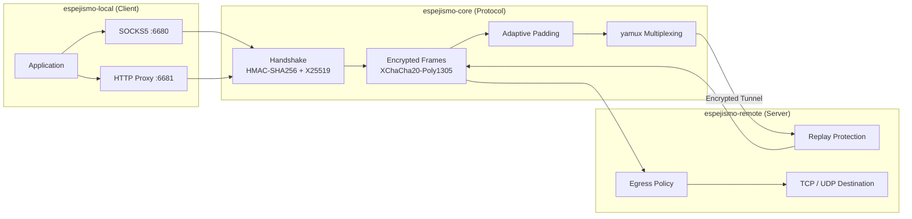

# Espejismo

**[🇬🇧 English](README.md) &nbsp;|&nbsp; [🇪🇸 Español](README_ES.md)**

<p>
  
  
  
  
  
  
</p>

A native cross-platform Rust encrypted transport tunnel for public and untrusted
networks. SOCKS5 & HTTP local ingress, X25519 forward secrecy, XChaCha20-Poly1305
encrypted frames, yamux multiplexing, adaptive padding, and client puzzles — all in
safe Rust with no TUN/TAP or system-level dependencies.

## Architecture



## Platform Support

| Platform | Arch | Status |
| --- | --- | --- |
| Linux | amd64, 386, arm64, armv7 | Supported |
| macOS | Apple Silicon (arm64) | Supported |
| Windows | amd64, 386, arm64 | Supported |

## Build

```bash
cargo build --release
```

Cross-platform CI checks Linux, macOS, and Windows. The release workflow builds
packaged artifacts for:

- `linux-amd64`
- `linux-386`
- `linux-arm64`
- `linux-armv7`
- `darwin-arm64`
- `windows-amd64`
- `windows-386`
- `windows-arm64`

Each archive contains:

- `bin/espejismo-local`
- `bin/espejismo-remote`
- `configs/espejismo.toml`
- README and architecture/testing notes

Create a package for the current Unix-like host:

```bash
./scripts/package-release.sh
```

Create a package on Windows PowerShell:

```powershell
.\scripts\package-release.ps1
```

You can also pass an installed Rust target triple:

```bash
rustup target add x86_64-unknown-linux-gnu
./scripts/package-release.sh x86_64-unknown-linux-gnu
```

## Quick Start

### Linux/macOS

Terminal 1 — remote:

```bash
ESPEJISMO_PSK='change-me-long-random-secret' \
cargo run --bin espejismo-remote -- --listen 0.0.0.0:6690
```

Terminal 2 — local:

```bash
ESPEJISMO_PSK='change-me-long-random-secret' \
cargo run --bin espejismo-local -- \
  --socks5-listen 127.0.0.1:6680 \
  --http-listen 127.0.0.1:6681 \
  --server 127.0.0.1:6690
```

### Windows PowerShell

Terminal 1 — remote:

```powershell
$env:ESPEJISMO_PSK = "change-me-long-random-secret"
cargo run --bin espejismo-remote -- --listen 127.0.0.1:6690
```

Terminal 2 — local:

```powershell
$env:ESPEJISMO_PSK = "change-me-long-random-secret"
cargo run --bin espejismo-local -- --socks5-listen 127.0.0.1:6680 --http-listen 127.0.0.1:6681 --server 127.0.0.1:6690
```

Then point a SOCKS5-capable client at `127.0.0.1:6680` or an HTTP proxy client
at `127.0.0.1:6681`.

### One-Line Ubuntu Remote Install

```bash
curl -fsSL https://raw.githubusercontent.com/OWNER/REPO/main/scripts/install-ubuntu-remote.sh \
  | sudo ESPEJISMO_REPO=OWNER/REPO ESPEJISMO_VERSION=latest bash
```

See [docs/deployment/QUICKSTART.md](docs/deployment/QUICKSTART.md) for all
installer variables and Windows client setup.

## Configuration

Generate a starter TOML config:

```bash
cargo run --bin espejismo-local -- --print-example-config > espejismo.toml
```

The same config can be used by both binaries; each one reads the relevant
section.

```toml
[shared]
psk = "change-me-long-random-secret"
clock_skew_secs = 30
puzzle_bits = 12
max_padding = 64
jitter_ms = 0
padding_chance_percent = 35
backpressure_threshold_ms = 40
backpressure_cooldown_ms = 1000
tunnel_buffer = 1048576
idle_timeout_secs = 300
max_streams = 256

[shared.obfuscation]
profile = "balanced"
randomize_chunks = true
min_chunk = 1024
max_chunk = 16384

[shared.stealth]
frame_size = 4096
tick_ms = 50

[local]
server = "127.0.0.1:6690"
socks5_listen = "127.0.0.1:6680"
http_listen = "127.0.0.1:6681"
handshake_padding = 256

[local.auth]
username = "local-user"
password = "local-pass"

[logging]
level = "info"
format = "compact"
ansi = true
# file = "/var/log/espejismo/espejismo.log"

[admin]
# listen = "127.0.0.1:9090"
# token = "change-me-admin-token"

[remote]
listen = "0.0.0.0:6690"
handshake_timeout_ms = 3000
reject_delay_ms = 0
max_handshake_padding = 1024
replay_window_secs = 60
cold_start_delay_ms = 35
tarpit_max = 1024
tarpit_hold_secs = 300

[remote.fallback_http]
mode = "silent"
# mode = "http_fallback"
# enabled = true # legacy switch, kept for backward compatibility
upstream = "127.0.0.1:8080"
probe_timeout_ms = 250
server = "nginx"
body = "<html><head><title>It works</title></head><body><h1>It works</h1></body></html>"

[remote.egress]
deny_private_ips = false
allow_hosts = []
block_hosts = []
allow_ports = []
block_ports = []
```

Run from a file:

```bash
cargo run --bin espejismo-remote -- --config espejismo.toml
cargo run --bin espejismo-local -- --config espejismo.toml
```

Run from a packaged release:

```bash
./bin/espejismo-remote --config configs/espejismo.toml
./bin/espejismo-local --config configs/espejismo.toml
```

Windows packaged release:

```powershell
.\bin\espejismo-remote.exe --config .\configs\espejismo.toml
.\bin\espejismo-local.exe --config .\configs\espejismo.toml
```

Windows setup helper:

```powershell
.\scripts\setup-windows.ps1 -Mode local -Server "YOUR_SERVER_IP:6690" -Psk "the-same-psk"
```

Run from base64-encoded TOML, useful for deployment panels or one-line imports:

```bash
CONFIG_B64="$(base64 -w0 espejismo.toml)"
cargo run --bin espejismo-remote -- --config-base64 "$CONFIG_B64"
cargo run --bin espejismo-local -- --config-base64 "$CONFIG_B64"
```

You can print an example directly as base64:

```bash
cargo run --bin espejismo-local -- --print-example-config-base64
```

## Handshake

The client first packet is intentionally variable length:

```text
[ HMAC-SHA256 32 ][ UTC timestamp 8 ][ nonce 24 ][ X25519 public key 32 ][ padding length 2 ][ padding 0..N ]
```

The current packet body also includes an 8-byte puzzle nonce before the padding
length:

```text
[ HMAC-SHA256 32 ][ UTC timestamp 8 ][ nonce 24 ][ X25519 public key 32 ][ puzzle nonce 8 ][ padding length 2 ][ padding 0..N ]
```

The client solves a bounded SHA-256 leading-zero puzzle over the body before it
computes the HMAC. The remote verifies the puzzle first, then checks the
timestamp skew, validates the HMAC in constant time, and keeps a bounded
in-memory replay cache of recently seen ephemeral public keys.

More detail lives in [docs/ARCHITECTURE.md](docs/ARCHITECTURE.md).

## Notes

- `espejismo-local --socks5-listen` enables the local SOCKS5 proxy.
- `espejismo-local --http-listen` enables the local HTTP proxy.
- `[local.auth]` enables local SOCKS5 username/password auth and HTTP Basic
  proxy auth. Omit it for a trusted loopback-only no-auth listener.
- `[logging]` controls structured logs. `format` can be `compact`, `pretty`, or
  `json`; `file` writes logs to a path instead of stderr.
- `--log-level`, `--log-format`, `--log-file`, and `--no-log-ansi` override the
  logging config for either binary.
- `[admin]` enables a read-only HTTP admin endpoint with `/healthz`, `/status`,
  and `/metrics`. Use `token` outside trusted loopback-only environments.
- `[remote.egress]` controls server-side outbound policy with host and port
  allow/block lists.
- `espejismo-local --print-client-profile` emits an
  `espejismo://import/...` profile URL that can be imported with
  `--import-profile`.
- SOCKS5 supports TCP `CONNECT` and UDP `ASSOCIATE`. UDP datagrams are relayed
  over authenticated yamux streams and checked by remote egress policy.
- `--max-padding` controls the maximum payload size of encrypted padding frames.
- `--padding-chance-percent` controls how often padding is attempted.
- `--backpressure-threshold-ms` detects slow writes and disables padding.
- `--backpressure-cooldown-ms` controls how long padding stays disabled after a
  slow write.
- `--jitter-ms` applies a small randomized delay before outgoing frames.
- `[shared.obfuscation]` controls sender-side traffic shape. `profile` can be
  `low_latency`, `balanced`, `high_entropy`, or `stealth`; `randomize_chunks`
  and the chunk bounds vary encrypted frame sizes before padding is added.
- `[shared.stealth]` is used when `profile = "stealth"`: every encrypted frame
  is exactly `frame_size` bytes and each side sends one frame every `tick_ms`
  milliseconds, using padding frames when no real data is queued.
- `--puzzle-bits` configures the client puzzle difficulty. Values are capped at
  24 bits.
- `espejismo-local --handshake-padding` controls the maximum random padding in
  the first packet.
- `espejismo-remote --max-handshake-padding` limits accepted first-packet
  padding.
- `espejismo-remote --replay-window-secs` controls the in-memory replay cache
  window.
- `espejismo-remote --handshake-timeout-ms` bounds incomplete handshakes.
- `espejismo-remote --reject-delay-ms` adds a bounded silent close delay for
  invalid handshakes. Values above 10000 ms are capped.
- `espejismo-remote --tarpit-max` controls the bounded silent tarpit size used
  when `reject_delay_ms = 0`.
- `espejismo-remote --tarpit-hold-secs` controls how long invalid sockets are
  retained in the tarpit before close.
- `[remote.fallback_http]` controls active-probe behavior. Use
  `mode = "silent"` for bounded silent handling, or `mode = "http_fallback"`
  to route HTTP probe prefixes to either a configured
  `upstream` TCP endpoint (for example local nginx) or an internal 200 OK page.
- `--tunnel-buffer` controls the in-process encrypted transport buffer used
  below yamux.
- `espejismo-remote --cold-start-delay-ms` applies a small startup delay after
  a valid handshake and before yamux begins.
- The PSK accepts `hex:...`, `base64:...`, or a raw UTF-8 string.
- Invalid handshakes are closed quietly by default. With
  `[remote.fallback_http].enabled = true`, probes receive HTTP-looking fallback
  responses instead.
- The tarpit is intentionally silent: it holds sockets briefly and never sends
  drip bytes to unknown peers.

## Smoke Test

```bash
./scripts/e2e_smoke.sh
```

On Windows PowerShell:

```powershell
.\scripts\e2e_smoke.ps1
```

The script starts a local HTTP server, `espejismo-remote`, and `espejismo-local`,
then performs SOCKS5 TCP, SOCKS5 UDP, HTTP proxy, HTTP CONNECT, admin, metrics,
and profile import checks through the encrypted yamux tunnel.

## Logging

Console logs default to compact human-readable output:

```toml
[logging]
level = "info"
format = "compact"
ansi = true
```

For production ingestion, use JSON logs:

```toml
[logging]
level = "info,espejismo_core=debug"
format = "json"
ansi = false
file = "/var/log/espejismo/espejismo.log"
```

The `level` field accepts normal tracing filter directives, so operators can
raise one module while keeping the rest quiet.

## Project Status

See [docs/development/STATUS.md](docs/development/STATUS.md) for the implemented
feature matrix and the remaining roadmap, including UDP, transparent migration,
WASM/browser packaging, metrics, and runtime reload.

See [docs/testing/TEST_PLAN.md](docs/testing/TEST_PLAN.md) for the executable
test strategy and [docs/research/DESIGN_PRINCIPLES.md](docs/research/DESIGN_PRINCIPLES.md)
for the protocol design principles.

## Disclaimer

Espejismo is intended solely for establishing encrypted connections to your own
home network or privately-owned servers while traveling. It is designed to protect
your data on untrusted public networks (e.g., hotel Wi-Fi, coffee shops, airports)
by routing traffic through a secure tunnel to infrastructure you control.

Users are solely responsible for ensuring that their use of this software complies
with all applicable local, state, national, and international laws and regulations.
The authors assume no liability for misuse. This project does not encourage, endorse,
or support any activity that violates the laws of any jurisdiction, including but
not limited to the regulations of the People's Republic of China regarding network
access and cross-border data transmission.
