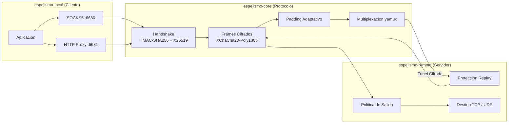

# Espejismo

**[🇬🇧 English](README.md) &nbsp;|&nbsp; [🇪🇸 Español](README_ES.md)**

<p>
  
  
  
  
  
  
</p>

Un tunel de transporte cifrado multiplataforma nativo en Rust para redes publicas
y no confiables. Ingreso local via SOCKS5 y HTTP, secreto directo con X25519,
frames cifrados con XChaCha20-Poly1305, multiplexacion yamux, padding adaptativo
y puzzles de cliente — todo en Rust seguro sin TUN/TAP ni dependencias del sistema.

## Arquitectura



## Plataformas Soportadas

| Plataforma | Arquitectura | Estado |
| --- | --- | --- |
| Linux | amd64, 386, arm64, armv7 | Soportado |
| macOS | Apple Silicon (arm64) | Soportado |
| Windows | amd64, 386, arm64 | Soportado |

## Compilacion

```bash
cargo build --release
```

CI multiplataforma verifica Linux, macOS y Windows. El workflow de release genera
artefactos empaquetados para:

- `linux-amd64`
- `linux-386`
- `linux-arm64`
- `linux-armv7`
- `darwin-arm64`
- `windows-amd64`
- `windows-386`
- `windows-arm64`

Cada archivo contiene:

- `bin/espejismo-local`
- `bin/espejismo-remote`
- `configs/espejismo.toml`
- README y notas de arquitectura/testing

Crear paquete para el host Unix-like actual:

```bash
./scripts/package-release.sh
```

Crear paquete en Windows PowerShell:

```powershell
.\scripts\package-release.ps1
```

Tambien se puede pasar un target triple de Rust instalado:

```bash
rustup target add x86_64-unknown-linux-gnu
./scripts/package-release.sh x86_64-unknown-linux-gnu
```

## Inicio Rapido

### Linux/macOS

Terminal 1 — servidor remoto:

```bash
ESPEJISMO_PSK='change-me-long-random-secret' \
cargo run --bin espejismo-remote -- --listen 0.0.0.0:6690
```

Terminal 2 — cliente local:

```bash
ESPEJISMO_PSK='change-me-long-random-secret' \
cargo run --bin espejismo-local -- \
  --socks5-listen 127.0.0.1:6680 \
  --http-listen 127.0.0.1:6681 \
  --server 127.0.0.1:6690
```

### Windows PowerShell

Terminal 1 — servidor remoto:

```powershell
$env:ESPEJISMO_PSK = "change-me-long-random-secret"
cargo run --bin espejismo-remote -- --listen 127.0.0.1:6690
```

Terminal 2 — cliente local:

```powershell
$env:ESPEJISMO_PSK = "change-me-long-random-secret"
cargo run --bin espejismo-local -- --socks5-listen 127.0.0.1:6680 --http-listen 127.0.0.1:6681 --server 127.0.0.1:6690
```

Luego apunta un cliente SOCKS5 a `127.0.0.1:6680` o un cliente de proxy HTTP
a `127.0.0.1:6681`.

### Instalacion Remota en Ubuntu con Un Comando

```bash
curl -fsSL https://raw.githubusercontent.com/OWNER/REPO/main/scripts/install-ubuntu-remote.sh \
  | sudo ESPEJISMO_REPO=OWNER/REPO ESPEJISMO_VERSION=latest bash
```

Ver [docs/deployment/QUICKSTART.md](docs/deployment/QUICKSTART.md) para todas
las variables del instalador y la configuracion del cliente Windows.

## Configuracion

Generar una configuracion TOML inicial:

```bash
cargo run --bin espejismo-local -- --print-example-config > espejismo.toml
```

La misma configuracion sirve para ambos binarios; cada uno lee su seccion correspondiente.

```toml
[shared]
psk = "change-me-long-random-secret"
clock_skew_secs = 30
puzzle_bits = 12
max_padding = 64
jitter_ms = 0
padding_chance_percent = 35
backpressure_threshold_ms = 40
backpressure_cooldown_ms = 1000
tunnel_buffer = 1048576
idle_timeout_secs = 300
max_streams = 256

[shared.obfuscation]
profile = "balanced"
randomize_chunks = true
min_chunk = 1024
max_chunk = 16384

[local]
server = "127.0.0.1:6690"
socks5_listen = "127.0.0.1:6680"
http_listen = "127.0.0.1:6681"
handshake_padding = 256

[local.auth]
username = "local-user"
password = "local-pass"

[logging]
level = "info"
format = "compact"
ansi = true
# file = "/var/log/espejismo/espejismo.log"

[admin]
# listen = "127.0.0.1:9090"
# token = "change-me-admin-token"

[remote]
listen = "0.0.0.0:6690"
handshake_timeout_ms = 3000
reject_delay_ms = 0
max_handshake_padding = 1024
replay_window_secs = 60
cold_start_delay_ms = 35
tarpit_max = 1024
tarpit_hold_secs = 300

[remote.egress]
deny_private_ips = false
allow_hosts = []
block_hosts = []
allow_ports = []
block_ports = []
```

Ejecutar desde un archivo:

```bash
cargo run --bin espejismo-remote -- --config espejismo.toml
cargo run --bin espejismo-local -- --config espejismo.toml
```

Ejecutar desde un release empaquetado:

```bash
./bin/espejismo-remote --config configs/espejismo.toml
./bin/espejismo-local --config configs/espejismo.toml
```

Release empaquetado en Windows:

```powershell
.\bin\espejismo-remote.exe --config .\configs\espejismo.toml
.\bin\espejismo-local.exe --config .\configs\espejismo.toml
```

Asistente de configuracion en Windows:

```powershell
.\scripts\setup-windows.ps1 -Mode local -Server "IP_DEL_SERVIDOR:6690" -Psk "el-mismo-psk"
```

Ejecutar desde TOML codificado en base64, util para paneles de despliegue o
importaciones de un solo comando:

```bash
CONFIG_B64="$(base64 -w0 espejismo.toml)"
cargo run --bin espejismo-remote -- --config-base64 "$CONFIG_B64"
cargo run --bin espejismo-local -- --config-base64 "$CONFIG_B64"
```

Imprimir un ejemplo directamente en base64:

```bash
cargo run --bin espejismo-local -- --print-example-config-base64
```

## Handshake

El primer paquete del cliente tiene longitud intencionalmente variable:

```text
[ HMAC-SHA256 32 ][ timestamp UTC 8 ][ nonce 24 ][ clave publica X25519 32 ][ longitud padding 2 ][ padding 0..N ]
```

El cuerpo del paquete actual tambien incluye un nonce de puzzle de 8 bytes antes
de la longitud del padding:

```text
[ HMAC-SHA256 32 ][ timestamp UTC 8 ][ nonce 24 ][ clave publica X25519 32 ][ nonce puzzle 8 ][ longitud padding 2 ][ padding 0..N ]
```

El cliente resuelve un puzzle acotado de SHA-256 con ceros iniciales sobre el
cuerpo antes de calcular el HMAC. El servidor remoto verifica primero el puzzle,
luego comprueba la desviacion de timestamp, valida el HMAC en tiempo constante,
y mantiene una cache en memoria acotada de las claves publicas efimeras vistas
recientemente.

Mas detalles en [docs/ARCHITECTURE.md](docs/ARCHITECTURE.md).

## Notas

- `espejismo-local --socks5-listen` habilita el proxy SOCKS5 local.
- `espejismo-local --http-listen` habilita el proxy HTTP local.
- `[local.auth]` habilita autenticacion SOCKS5 por usuario/contrasena y
  autenticacion HTTP Basic del proxy. Omitir para un listener sin autenticacion
  solo en loopback confiable.
- `[logging]` controla los logs estructurados. `format` puede ser `compact`,
  `pretty`, o `json`; `file` escribe logs a un archivo en lugar de stderr.
- `--log-level`, `--log-format`, `--log-file`, y `--no-log-ansi` sobreescriben
  la configuracion de logging para ambos binarios.
- `[admin]` habilita un endpoint HTTP admin de solo lectura con `/healthz`,
  `/status`, y `/metrics`. Usar `token` fuera de entornos loopback confiables.
- `[remote.egress]` controla la politica de salida del servidor con listas de
  hosts y puertos permitidos/bloqueados.
- `espejismo-local --print-client-profile` emite un URL de perfil
  `espejismo://import/...` que puede importarse con `--import-profile`.
- SOCKS5 soporta `CONNECT` TCP y `ASSOCIATE` UDP. Los datagramas UDP se retransmiten
  por streams yamux autenticados y son verificados por la politica de salida remota.
- `--max-padding` controla el tamano maximo del payload de los frames de padding
  cifrados.
- `--padding-chance-percent` controla la frecuencia con la que se intenta el padding.
- `--backpressure-threshold-ms` detecta escrituras lentas y deshabilita el padding.
- `--backpressure-cooldown-ms` controla cuanto tiempo permanece deshabilitado el
  padding tras una escritura lenta.
- `--jitter-ms` aplica un pequeno retraso aleatorio antes de enviar frames.
- `[shared.obfuscation]` controla la forma del trafico del emisor. `profile` puede
  ser `low_latency`, `balanced`, o `high_entropy`; `randomize_chunks` y los limites
  de fragmentos varian los tamanios de frames cifrados antes de agregar padding.
- `--puzzle-bits` configura la dificultad del puzzle del cliente. Valores limitados
  a 24 bits.
- `espejismo-local --handshake-padding` controla el padding aleatorio maximo en
  el primer paquete.
- `espejismo-remote --max-handshake-padding` limita el padding aceptado en el
  primer paquete.
- `espejismo-remote --replay-window-secs` controla la ventana de la cache de
  replay en memoria.
- `espejismo-remote --handshake-timeout-ms` acota los handshakes incompletos.
- `espejismo-remote --reject-delay-ms` agrega un retraso de cierre silencioso
  acotado para handshakes invalidos. Valores superiores a 10000 ms son limitados.
- `espejismo-remote --tarpit-max` controla el tamano del tarpit silencioso acotado
  usado cuando `reject_delay_ms = 0`.
- `espejismo-remote --tarpit-hold-secs` controla cuanto tiempo se retienen los
  sockets invalidos en el tarpit silencioso acotado.
- `--tunnel-buffer` controla el buffer de transporte cifrado en proceso usado
  por debajo de yamux.
- `espejismo-remote --cold-start-delay-ms` aplica un pequeno retraso de inicio
  tras un handshake valido y antes de que comience yamux.
- La PSK acepta `hex:...`, `base64:...`, o una cadena UTF-8 cruda.
- Los handshakes invalidos se cierran silenciosamente y sin datos de aplicacion.
- El tarpit es intencionalmente silencioso: retiene sockets brevemente y nunca
  envia bytes de goteo a pares desconocidos.

## Smoke Test

```bash
./scripts/e2e_smoke.sh
```

En Windows PowerShell:

```powershell
.\scripts\e2e_smoke.ps1
```

El script inicia un servidor HTTP local, `espejismo-remote`, y `espejismo-local`,
luego realiza verificaciones de SOCKS5 TCP, SOCKS5 UDP, proxy HTTP, HTTP CONNECT,
admin, metricas e importacion de perfil a traves del tunel yamux cifrado.

## Logging

Los logs de consola por defecto usan formato compacto legible:

```toml
[logging]
level = "info"
format = "compact"
ansi = true
```

Para ingesta en produccion, usar logs JSON:

```toml
[logging]
level = "info,espejismo_core=debug"
format = "json"
ansi = false
file = "/var/log/espejismo/espejismo.log"
```

El campo `level` acepta directivas normales de filtro de tracing, para que los
operadores puedan elevar un modulo manteniendo el resto en silencio.

## Estado del Proyecto

Ver [docs/development/STATUS.md](docs/development/STATUS.md) para la matriz de
funcionalidades implementadas y la hoja de ruta restante, incluyendo UDP,
migracion transparente, empaquetado WASM/navegador, metricas y recarga en tiempo
de ejecucion.

Ver [docs/testing/TEST_PLAN.md](docs/testing/TEST_PLAN.md) para la estrategia
de pruebas ejecutable y [docs/research/DESIGN_PRINCIPLES.md](docs/research/DESIGN_PRINCIPLES.md)
para los principios de diseno del protocolo.

## Descargo de Responsabilidad

Espejismo esta destinado unicamente a establecer conexiones cifradas a su propia
red domestica o servidores de propiedad privada durante sus viajes. Esta disenado
para proteger sus datos en redes publicas no confiables (por ejemplo, Wi-Fi de
hoteles, cafeterias, aeropuertos) enrutando el trafico a traves de un tunel seguro
hacia infraestructura que usted controla.

Los usuarios son los unicos responsables de asegurar que el uso de este software
cumple con todas las leyes y regulaciones locales, estatales, nacionales e
internacionales aplicables. Los autores no asumen ninguna responsabilidad por uso
indebido. Este proyecto no fomenta, respalda ni apoya ninguna actividad que viole
las leyes de ninguna jurisdiccion, incluyendo pero no limitado a las regulaciones
de la Republica Popular China sobre acceso a redes y transmision de datos
transfronteriza.
