# Espejismo

**[🇬🇧 English](README.md) &nbsp;|&nbsp; [🇪🇸 Español](README_ES.md)**

<p>
  
  
  
  
  
  
</p>

Un tunel de transporte cifrado multiplataforma nativo en Rust para redes publicas
y no confiables. Ingreso local via SOCKS5, HTTP, y TUN nativo opcional, secreto
directo con X25519, frames cifrados con XChaCha20-Poly1305, multiplexacion yamux,
padding adaptativo, pacing amigable con TCP, y puzzles de cliente.

Version actual: `v0.0.2`.

## Arquitectura

### Vista del Sistema

```mermaid
flowchart LR
    subgraph Local["espejismo-local"]
        APP["Aplicacion"]
        SOCKS["Ingreso SOCKS5<br/>TCP CONNECT + UDP ASSOCIATE"]
        HTTP["Ingreso proxy HTTP<br/>CONNECT + HTTP absolute-form"]
        AUTH["Auth local opcional"]
        YMUX_C["Sesion cliente yamux<br/>streams logicos"]
        ENC_C["Adaptador de transporte cifrado"]
    end

    subgraph Wire["Conexion TCP publica"]
        FLOW["Flujo de bytes protegido con AEAD<br/>perfil estandar o stealth"]
    end

    subgraph Remote["espejismo-remote"]
        PROBE["Guardia de probes<br/>fallback HTTP o tarpit silencioso"]
        HS["Verificador de handshake<br/>HMAC + X25519 + puzzle + cache replay"]
        ENC_R["Adaptador de transporte cifrado"]
        YMUX_R["Sesion servidor yamux"]
        REQ["Parser de solicitudes de tunel"]
        POLICY["Politica de salida<br/>ACL de host + puerto + cadena SOCKS5"]
        DEST["Destino TCP / UDP"]
    end

    APP --> SOCKS --> AUTH --> YMUX_C
    APP --> HTTP --> AUTH
    YMUX_C --> ENC_C --> FLOW --> PROBE --> HS --> ENC_R --> YMUX_R
    YMUX_R --> REQ --> POLICY --> DEST
```



El detalle importante de la estructura en capas es que yamux gestiona los
streams logicos, mientras `spawn_frame_transport` proporciona a yamux un
objeto `AsyncRead + AsyncWrite` normal respaldado por frames cifrados. Las
solicitudes del proxy local se convierten en streams yamux; el socket fisico
transporta solo el transporte cifrado.

### Pila de Protocolo

```text
Trafico de aplicacion
  -> parser de proxy SOCKS5 / HTTP
  -> auth de proxy local opcional
  -> stream logico yamux
  -> transporte de frames cifrados
  -> socket TCP
  -> handshake remoto / defensas replay / probe
  -> manejador de streams yamux
  -> politica de salida
  -> conexion TCP o rele UDP de un solo disparo
```

### Handshake

El modo estandar comienza con un hello de cliente autenticado de longitud
variable:

```text
[ HMAC-SHA256 32 ][ timestamp UTC 8 ][ nonce 24 ][ clave publica X25519 32 ]
[ version de protocolo 2 ][ capacidades 8 ][ nonce puzzle 8 ]
[ longitud padding 2 ][ padding 0..N ]
```

El cliente resuelve un puzzle acotado de SHA-256 con ceros iniciales sobre el
cuerpo antes de calcular el HMAC. El remoto verifica el puzzle, comprueba la
desviacion de timestamp, valida el HMAC en tiempo constante, y registra la
clave publica efimera en una cache de replay acotada. Las claves de sesion se
derivan con X25519 y HKDF-SHA256.

Cuando `profile = "stealth"`, el intercambio hello se envuelve en dos bloques
de tamano fijo que coinciden con `shared.stealth.frame_size`. La carga util
del bloque esta enmascarada con un flujo XOR derivado de HMAC y padding
aleatorio, por lo que el handshake no expone la longitud del hello en modo
plain ni el hello del servidor de tamano fijo.

### Transporte de Frames

Los perfiles estandar usan frames AEAD con longitud prefijada enmascarada:

```text
[ longitud cifrada enmascarada 4 ][ XChaCha20-Poly1305(tipo || payload) ]
```

`low_latency`, `balanced`, y `high_entropy` ajustan la aleatorizacion de
fragmentos, jitter, y padding adaptativo alrededor de ese formato de frame
estandar.

El modo stealth usa frames AEAD de tamano fijo sin cabecera de longitud:

```text
[ XChaCha20-Poly1305 texto cifrado exactamente shared.stealth.frame_size bytes ]

texto plano antes del cifrado:
[ tipo 1 ][ payload_len 2 ][ payload ][ padding aleatorio hasta tamano fijo ]
```

La bomba de subida envia un calentamiento corto de padding aleatorio tras el
handshake stealth, luego escribe frames de datos o padding en un calendario
dosificado. Si no hay datos de aplicacion en cola, la cadencia de inactividad
decae desde el `tick_ms` base hacia intervalos mas lentos tipo heartbeat; los
datos reales reinician la cadencia. Se aplica un pequeno jitter pre-escritura
para que los frames de datos y padding no tengan un comportamiento de
planificador identico.

### Comportamiento de Probe y Fallback

Los pares desconocidos o invalidos no reciben error de protocolo. Dependiendo
de la configuracion remota, son retenidos en un tarpit silencioso acotado o,
para probes con aspecto HTTP, enrutados a un upstream de fallback configurado.
Si no hay upstream configurado, el fallback integrado devuelve una pequena
respuesta HTTP 200 con cabeceras `Date`, `Last-Modified`, `ETag`,
`Content-Length`, `Connection`, y `Server` dinamicas. Un upstream real como
Nginx/Caddy sigue siendo el fallback de produccion preferido porque hereda una
huella de servidor web completa y natural.

### Lo que Stealth Ayuda a Mitigar

| Senal observable | Mitigacion en este codigo | Salvedad restante |
| --- | --- | --- |
| Tamano del handshake en plain | Stealth envuelve hello/respuesta en bloques enmascarados de tamano fijo | Los primeros dos bloques siguen siendo metadatos de inicio de conexion |
| Distribucion de tamano de frames | Todos los frames de datos, cierre, y padding stealth usan un tamano | Los flujos de tamano fijo pueden ser inusuales por si mismos |
| Comportamiento de rafaga/silencio | Los frames de padding continuan cuando no hay datos de aplicacion en cola | La cadencia de inactividad decae deliberadamente para reducir huellas de flujo constante |
| Asimetria de direccion | Ambos lados ejecutan el mismo comportamiento de transporte stealth | La planificacion del kernel y la congestion pueden diferir por direccion |
| Clasificacion de payload | AEAD oculta el tipo y contenido del frame | El volumen de trafico, endpoint, y duracion siguen siendo visibles |
| Probes HTTP activos | Fallback a upstream opcional o respuesta integrada dinamica | El fallback integrado es una comodidad, no un sustituto de un sitio web real |

Stealth es un perfil de conformacion de trafico, no una garantia matematica de
indetectabilidad. Reduce varias huellas de protocolo obvias, pero los
observadores de red pueden seguir modelando metadatos como la reputacion del
endpoint, duracion de la conexion, volumen total de bytes, comportamiento de
reintento, y efectos de congestion.

## Plataformas Soportadas

| Plataforma | Arquitectura | Estado |
| --- | --- | --- |
| Linux | amd64, 386, arm64, armv7 | Soportado |
| macOS | Apple Silicon (arm64) | Soportado |
| Windows | amd64, 386, arm64 | Soportado |

## Descarga

Los usuarios normales no necesitan Rust ni Cargo. Descarga el archivo de release
para tu plataforma, extraelo, y ejecuta los binarios dentro de `bin/`.

Artefactos de release:

- `linux-amd64`
- `linux-386`
- `linux-arm64`
- `linux-armv7`
- `darwin-arm64`
- `windows-amd64`
- `windows-386`
- `windows-arm64`

Cada archivo contiene:

- `bin/espejismo-local`
- `bin/espejismo-remote`
- `configs/espejismo.toml`
- README, changelog, notas de arquitectura, despliegue, CLI, usuarios,
  actualizaciones, estado y testing

## Inicio Rapido Para Usuarios

### Servidor Linux

Descarga y extrae el release de Linux en el servidor, luego ejecuta:

```bash
./bin/espejismo-remote --config configs/espejismo.toml
```

O instala el endpoint remoto en Ubuntu con un comando:

```bash
curl -fsSL https://raw.githubusercontent.com/OWNER/REPO/main/scripts/install-ubuntu-remote.sh \
  | sudo ESPEJISMO_REPO=OWNER/REPO ESPEJISMO_VERSION=latest bash
```

### Cliente macOS

Descarga y extrae el release de macOS, edita `configs/espejismo.toml` para que
`local.server` apunte al servidor remoto, y ejecuta:

```bash
./bin/espejismo-local --config configs/espejismo.toml
```

Usa estos endpoints de proxy local:

```text
SOCKS5:     127.0.0.1:6680
HTTP proxy: 127.0.0.1:6681
```

### Cliente Windows

Descarga y extrae el release de Windows, luego ejecuta PowerShell desde el
directorio extraido:

```powershell
.\bin\espejismo-local.exe --config .\configs\espejismo.toml
```

O genera una configuracion local desde un perfil de importacion:

```powershell
.\scripts\setup-windows.ps1 -Mode local -ProfileUrl "espejismo://import/..."
```

### Importacion de Configuracion en Una Linea

Ambos binarios pueden usar una configuracion base64 de una sola linea, util
para paneles o despliegues por copiar/pegar:

```bash
CONFIG_B64="$(./bin/espejismo-local --config configs/espejismo.toml --print-config-base64)"
./bin/espejismo-local --config-base64 "$CONFIG_B64"
./bin/espejismo-local --decode-config-base64 "$CONFIG_B64" > espejismo.toml
```

### Comprobar Actualizaciones

```bash
./bin/espejismo-local --check-update
./bin/espejismo-remote --check-update
```

Ver [docs/deployment/QUICKSTART.md](docs/deployment/QUICKSTART.md) para flujos
detallados de despliegue en Linux, macOS, y Windows.

## Compilacion Para Desarrolladores

Los desarrolladores que clonan el repositorio necesitan Rust/Cargo.

```bash
git clone https://github.com/tianrking/Espejismo.git
cd Espejismo
cargo build --release
```

Ejecutar desde codigo fuente durante desarrollo:

```bash
cargo run --bin espejismo-remote -- --config configs/examples/espejismo.toml
cargo run --bin espejismo-local -- --config configs/examples/espejismo.toml
```

Crear un paquete local:

```bash
./scripts/package-release.sh
```

Windows PowerShell:

```powershell
.\scripts\package-release.ps1
```

## Configuracion

Generar una configuracion TOML inicial:

```bash
./bin/espejismo-local --print-example-config > espejismo.toml
```

La misma configuracion sirve para ambos binarios; cada uno lee su seccion correspondiente.

```toml
[shared]
psk = "change-me-long-random-secret"
clock_skew_secs = 30
puzzle_bits = 12
max_padding = 64
jitter_ms = 0
padding_chance_percent = 35
backpressure_threshold_ms = 40
backpressure_cooldown_ms = 1000
tunnel_buffer = 1048576
idle_timeout_secs = 300
max_streams = 256

[shared.obfuscation]
profile = "balanced"
randomize_chunks = true
min_chunk = 1024
max_chunk = 16384

[shared.stealth]
frame_size = 4096
tick_ms = 50

[local]
server = "127.0.0.1:6690"
socks5_listen = "127.0.0.1:6680"
http_listen = "127.0.0.1:6681"
handshake_padding = 256

[local.auth]
username = "local-user"
password = "local-pass"

[logging]
level = "info"
format = "compact"
ansi = true
# file = "/var/log/espejismo/espejismo.log"

[admin]
# listen = "127.0.0.1:9090"
# token = "change-me-admin-token"

[remote]
listen = "0.0.0.0:6690"
handshake_timeout_ms = 3000
reject_delay_ms = 0
max_handshake_padding = 1024
replay_window_secs = 60
cold_start_delay_ms = 35
tarpit_max = 1024
tarpit_hold_secs = 300

[remote.fallback_http]
mode = "silent"
# mode = "http_fallback"
# enabled = true # interruptor legacy, mantenido por compatibilidad
upstream = "127.0.0.1:8080"
probe_timeout_ms = 250
server = "nginx"
body = "<html><head><title>It works</title></head><body><h1>It works</h1></body></html>"

[[remote.users]]
name = "default"
psk = "change-me-long-random-secret"

[remote.users.quota]
# bytes = 536870912
window_secs = 86400

[remote.users.bandwidth]
# bytes_per_sec = 1048576

[remote.egress]
deny_private_ips = false
allow_hosts = []
block_hosts = []
allow_ports = []
block_ports = []
# socks5_proxy = "127.0.0.1:1080"
```

Ejecutar desde un archivo:

```bash
./bin/espejismo-remote --config espejismo.toml
./bin/espejismo-local --config espejismo.toml
```

Ejecutar desde un release empaquetado:

```bash
./bin/espejismo-remote --config configs/espejismo.toml
./bin/espejismo-local --config configs/espejismo.toml
```

Release empaquetado en Windows:

```powershell
.\bin\espejismo-remote.exe --config .\configs\espejismo.toml
.\bin\espejismo-local.exe --config .\configs\espejismo.toml
```

Asistente de configuracion en Windows:

```powershell
.\scripts\setup-windows.ps1 -Mode local -Server "IP_DEL_SERVIDOR:6690" -Psk "el-mismo-psk"
```

Ejecutar desde TOML codificado en base64, util para paneles de despliegue o
importaciones de un solo comando:

```bash
CONFIG_B64="$(base64 -w0 espejismo.toml)"
./bin/espejismo-remote --config-base64 "$CONFIG_B64"
./bin/espejismo-local --config-base64 "$CONFIG_B64"
```

Espejismo tambien puede convertir configuraciones sin depender de flags
base64 especificos del shell:

```bash
CONFIG_B64="$(./bin/espejismo-local --config espejismo.toml --print-config-base64)"
./bin/espejismo-local --decode-config-base64 "$CONFIG_B64" > espejismo.toml
```

Imprimir un ejemplo directamente en base64:

```bash
./bin/espejismo-local --print-example-config-base64
```

Comprobar si hay un release mas nuevo:

```bash
./bin/espejismo-local --check-update
./bin/espejismo-remote --check-update
```

## Handshake

El protocolo de handshake se describe en detalle en la seccion
[Arquitectura](#arquitectura) anterior, cubriendo los modos plain y stealth.
Los detalles internos adicionales del protocolo y la especificacion del formato
en vivo se encuentran en [docs/ARCHITECTURE.md](docs/ARCHITECTURE.md).

## Notas

- `espejismo-local --socks5-listen` habilita el proxy SOCKS5 local.
- `espejismo-local --http-listen` habilita el proxy HTTP local.
- `[local.tun]` habilita un ingreso TUN nativo opcional para capturar trafico
  del sistema. Convierte flujos TCP y datagramas UDP de la interfaz virtual al
  tunel cifrado TCP/yamux existente. La toma de rutas y DNS en Linux y Windows es
  explicita con `[local.tun.route]`; ver [docs/deployment/TUN.md](docs/deployment/TUN.md).
- `[local.auth]` habilita autenticacion SOCKS5 por usuario/contrasena y
  autenticacion HTTP Basic del proxy. Omitir para un listener sin autenticacion
  solo en loopback confiable.
- `[logging]` controla los logs estructurados. `format` puede ser `compact`,
  `pretty`, o `json`; `file` escribe logs a un archivo en lugar de stderr.
- `--log-level`, `--log-format`, `--log-file`, y `--no-log-ansi` sobreescriben
  la configuracion de logging para ambos binarios.
- `[admin]` habilita un endpoint HTTP admin con `/healthz`, `/status`,
  `/connections`, `/metrics`, y `/reload`/`/apply` en el remoto. Usar `token`
  fuera de entornos loopback confiables.
- `[remote.egress]` controla la politica de salida del servidor con listas de
  hosts y puertos permitidos/bloqueados.
- `local.server` y `--server` aceptan `ip:puerto` o `dominio:puerto`; el
  cliente local resuelve el nombre antes de abrir el tunel fisico.
- `[shared.tcp]` controla TCP_NODELAY, keepalive, frames heartbeat, buffers de
  envio/recepcion, y TCP_USER_TIMEOUT / control de congestion opcionales en
  Linux, por ejemplo `bbr` o `cubic`.
- `[shared.pacing]` habilita pacing de escritura amigable con TCP.
  `max_bytes_per_sec = 0` mantiene throughput ilimitado y conserva los ajustes
  de burst y coalescing.
- `[[remote.users]]` habilita multiples usuarios remotos independientes, cada
  uno con su propia PSK. Si no hay usuarios configurados, el servidor usa
  `shared.psk`.
- `[remote.users.quota]` define una cuota de bytes por usuario con ventana
  movil. `bytes` queda deshabilitado si se omite; `window_secs` usa 86400 por
  defecto.
- `[remote.users.bandwidth]` define un limite agregado opcional de bytes por
  segundo por usuario para trafico TCP y UDP. Ver
  [docs/deployment/USERS.md](docs/deployment/USERS.md).
- `[remote.egress].socks5_proxy` encadena salida TCP y UDP a traves de otro
  proxy SOCKS5. UDP usa SOCKS5 UDP ASSOCIATE.
- `espejismo-local --print-client-profile` emite un URL de perfil
  `espejismo://import/...` que puede importarse con `--import-profile`.
- `--print-config-base64` imprime la configuracion TOML seleccionada como una
  cadena base64 de una sola linea. `--decode-config-base64` vuelve a imprimir
  esa cadena como TOML.
- `--check-update` consulta metadatos de release e imprime si hay una version
  mas nueva. `--update-url` puede apuntar a un endpoint JSON compatible con
  `tag_name` o `latest_version`. Ver
  [docs/deployment/UPDATES.md](docs/deployment/UPDATES.md).
- `--check-config --config espejismo.toml` valida errores comunes de despliegue:
  DNS, bind de listeners, PSK debil, admin sin token, egress amplio, usuarios
  duplicados, cuotas, ancho de banda, y pacing.
- SOCKS5 soporta `CONNECT` TCP y `ASSOCIATE` UDP. Los datagramas UDP se
  transportan por streams yamux autenticados y son verificados por la politica
  de salida remota.
- La ruta estable de produccion es TCP/yamux. SOCKS5 UDP ASSOCIATE es un rele
  UDP de aplicacion sobre ese tunel TCP; el underlay UDP fisico queda reservado
  para experimentos y no es el modo recomendado de despliegue.
- `--max-padding` controla el tamano maximo del payload de los frames de padding
  cifrados.
- `--padding-chance-percent` controla la frecuencia con la que se intenta el padding.
- `--backpressure-threshold-ms` detecta escrituras lentas y deshabilita el padding.
- `--backpressure-cooldown-ms` controla cuanto tiempo permanece deshabilitado el
  padding tras una escritura lenta.
- `--jitter-ms` aplica un pequeno retraso aleatorio antes de enviar frames.
- `[shared.obfuscation]` controla la forma del trafico del emisor. `profile` puede
  ser `low_latency`, `balanced`, `high_entropy`, o `stealth`; `randomize_chunks`
  y los limites de fragmentos varian los tamanios de frames cifrados antes de
  agregar padding.
- `[shared.stealth]` se usa cuando `profile = "stealth"`: cada frame cifrado
  mide exactamente `frame_size` bytes. El transporte comienza con un
  calentamiento corto de padding aleatorio, envia datos o padding en una
  cadencia dosificada, y gradualmente reduce el padding de inactividad hacia
  intervalos tipo heartbeat antes de que los datos reales lo reinicien.
- `--puzzle-bits` configura la dificultad del puzzle del cliente. Valores limitados
  a 24 bits.
- `espejismo-local --handshake-padding` controla el padding aleatorio maximo en
  el primer paquete.
- `espejismo-remote --max-handshake-padding` limita el padding aceptado en el
  primer paquete.
- `espejismo-remote --replay-window-secs` controla la ventana de la cache de
  replay en memoria.
- `espejismo-remote --handshake-timeout-ms` acota los handshakes incompletos.
- `espejismo-remote --reject-delay-ms` agrega un retraso de cierre silencioso
  acotado para handshakes invalidos. Valores superiores a 10000 ms son limitados.
- `espejismo-remote --tarpit-max` controla el tamano del tarpit silencioso acotado
  usado cuando `reject_delay_ms = 0`.
- `espejismo-remote --tarpit-hold-secs` controla cuanto tiempo se retienen los
  sockets invalidos en el tarpit silencioso acotado.
- `[remote.fallback_http]` controla el comportamiento ante probes activos. Usar
  `mode = "silent"` para manejo silencioso acotado, o `mode = "http_fallback"`
  para enrutar prefijos de probe HTTP a un endpoint TCP `upstream` configurado
  (por ejemplo nginx local) o a una pagina 200 OK interna.
- `--tunnel-buffer` controla el buffer de transporte cifrado en proceso usado
  por debajo de yamux.
- `espejismo-remote --cold-start-delay-ms` aplica un pequeno retraso de inicio
  tras un handshake valido y antes de que comience yamux.
- La PSK acepta `hex:...`, `base64:...`, o una cadena UTF-8 cruda.
- Los handshakes invalidos se cierran silenciosamente por defecto. Con
  `[remote.fallback_http].enabled = true`, los probes reciben respuestas de
  fallback con aspecto HTTP en su lugar.
- El tarpit es intencionalmente silencioso: retiene sockets brevemente y nunca
  envia bytes de goteo a pares desconocidos.

## Smoke Test

```bash
./scripts/e2e_smoke.sh
```

En Windows PowerShell:

```powershell
.\scripts\e2e_smoke.ps1
```

El script inicia un servidor HTTP local, `espejismo-remote`, y `espejismo-local`,
luego realiza verificaciones de SOCKS5 TCP, SOCKS5 UDP, proxy HTTP, HTTP CONNECT,
admin, metricas e importacion de perfil a traves del tunel yamux cifrado.

## Logging

Los logs de consola por defecto usan formato compacto legible:

```toml
[logging]
level = "info"
format = "compact"
ansi = true
```

Para ingesta en produccion, usar logs JSON:

```toml
[logging]
level = "info,espejismo_core=debug"
format = "json"
ansi = false
file = "/var/log/espejismo/espejismo.log"
```

El campo `level` acepta directivas normales de filtro de tracing, para que los
operadores puedan elevar un modulo manteniendo el resto en silencio.

## Estado del Proyecto

Ver [docs/development/STATUS.md](docs/development/STATUS.md) para la matriz de
funcionalidades implementadas y la hoja de ruta restante, incluyendo migracion
transparente, empaquetado WASM/navegador, integracion de socket UDP underlay, y
control de multiples perfiles mas rico.

Ver [CHANGELOG.md](CHANGELOG.md) para las notas de release.

Ver [docs/deployment/CLI.md](docs/deployment/CLI.md) para uso de linea de
comandos, [docs/testing/TEST_PLAN.md](docs/testing/TEST_PLAN.md) para la
estrategia de pruebas ejecutable y
[docs/research/DESIGN_PRINCIPLES.md](docs/research/DESIGN_PRINCIPLES.md) para
los principios de diseno del protocolo.

## Uso Responsable

Espejismo esta destinado para acceso cifrado a sistemas que usted posee o esta
explicitamente autorizado a administrar, como un laboratorio casero, servidor
privado, o entorno de pruebas interno. No es un servicio, red de anonimato, ni
herramienta de evasion de autorizacion.

La conformacion de trafico puede reducir algunas huellas de protocolo, pero no
hace invisible una conexion. Los operadores deben asumir que los endpoints,
timing, volumen de bytes, uptime, ruta de enrutamiento, y errores de despliegue
pueden seguir siendo observables. Usar upstreams de fallback reales, logging
conservador, PSKs fuertes, y politica de salida restrictiva en produccion.

Usted es responsable de cumplir con todas las leyes aplicables, politicas de red,
terminos de servicio, controles de exportacion, y limites de autorizacion en su
jurisdiccion y en cualquier red donde despliegue o use este software. No use
Espejismo para acceder a sistemas sin permiso, evadir controles de acceso legales,
o violar regulaciones locales. Este README es documentacion tecnica, no consejo
legal; consulte a un profesional cualificado si su despliegue tiene riesgo legal
o de cumplimiento.
