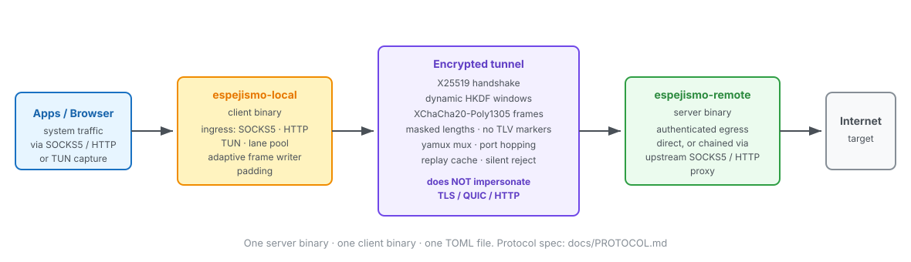

# Espejismo Architecture



## Textual Architecture Map

```text
Client machine                                               Remote machine
┌──────────────────────────────┐                    ┌─────────────────────────────┐
│ Applications / system flows  │                    │                             │
│  SOCKS5 · HTTP · optional TUN│                    │                             │
└──────────────┬───────────────┘                    │                             │
               v                                    │                             │
┌──────────────────────────────┐                    │                             │
│ espejismo-local              │                    │                             │
│ ingress → internal commands  │                    │                             │
│ mux → authenticated lanes    │                    │                             │
└──────────────┬───────────────┘                    │                             │
               │ TCP (optional WebSocket / HTTP/2 underlay)                        │
               └── encrypted Espejismo frames ────>┌─────────────────────────────┐
                                                    │ espejismo-remote            │
                                                    │ listener → auth → mux       │
                                                    │ stream request → egress     │
                                                    └──────────────┬──────────────┘
                                                                   v
                                                    Destination or configured proxy
```

Each process reads the shared TOML configuration with its local or remote
section; CLI overrides and runtime admin updates affect the corresponding
process. The local listener converts SOCKS5, HTTP proxy, or optional TUN traffic
into internal tunnel commands. Commands travel as independent mux streams over
authenticated physical lanes. On the remote, each stream is checked against
egress policy and relayed to its destination, directly or through a configured
upstream proxy. SOCKS5 UDP relay is an application-level flow over the same TCP
tunnel. The diagram does not represent the experimental UDP underlay primitives
as a production path.

This map shows component ownership and the ordinary data path. The following
sections detail handshake and frame formats, underlay choices, mux behavior,
failure scopes, configuration, and egress policy.

## Goals

Espejismo is a native Rust encrypted transport for public and untrusted
networks. The implementation keeps the protocol split into small modules so the
cryptographic handshake, replay protection, framing, padding, and application
relay can evolve independently.

Espejismo does not impersonate TLS, HTTP/2, QUIC, or any other named
application protocol. The design goal is an authenticated private encrypted byte
stream with no stable cleartext TLV markers or borrowed protocol fingerprint.

## Crates

- `espejismo-core`: shared protocol library. It owns the handshake, replay
  cache, client puzzle, AEAD frame codec, padding generation, SOCKS5 parsing,
  HTTP proxy parsing, configuration/profile loading, encrypted transport
  adapter, UDP underlay primitives, update metadata checks, and adaptive frame
  writer.
- `espejismo-client`: builds `espejismo-local`, the local SOCKS5 and HTTP proxy
  ingress.
- `espejismo-server`: builds `espejismo-remote`, the authenticated remote
  egress.

## Handshake Pipeline

The standard first packet is a variable-length masked envelope:

```text
[ random nonce 24 ][ masked payload length 4 ][ masked payload + random tail padding ]

masked payload:
[ HMAC-SHA256 ][ UTC timestamp ][ nonce ][ X25519 public key ][ protocol version ][ capabilities ][ puzzle nonce ][ padding length ][ padding ]
```

The 4-byte envelope length and the payload are XOR-masked with HMAC-derived
streams keyed by the handshake authentication key. By default that key is a
dynamic HKDF output bound to `floor(unix_time /
shared.handshake_window.step_secs)`. The client sends with the current slot;
the server tries the current slot and the configured adjacent tolerance. This
keeps robust async parsing while moving the fixed HMAC/timestamp/public-key
offsets and fixed server reply out of the clear wire image, and it prevents an
old recorded first packet from authenticating after the accepted windows expire.
Inside the envelope, the client solves a bounded SHA-256 leading-zero puzzle
over the body before it computes the HMAC. The remote verifies the puzzle before
the HMAC, checks timestamp skew, and records the ephemeral public key in a
bounded replay cache. The current protocol version is `1`; capability bit 0
enables TCP CONNECT, bit 1 enables SOCKS5 UDP ASSOCIATE datagram relay, bit 8
enables `yamux`, and bit 9 enables the in-tree native mux. The configured mux
mode must be present in the peer capability set. Mismatches fail during the
authenticated handshake with an explicit mux capability error.

## Frame Pipeline

After the handshake, both sides use HKDF-derived XChaCha20-Poly1305 keys. Frames
normally use length-prefixed encrypted super-frames:

```text
[ masked ciphertext length 4 ][ AEAD(frame type || payload) ]
```

The 4-byte length field is XOR-masked with a per-direction HKDF-derived
header-mask stream keyed by frame sequence. This keeps the robust length-based
framing model while removing the plaintext TLV length signal from the wire. Any
AEAD failure is fail-fast: the caller receives an error and the physical TCP
connection is discarded. The protocol does not try to resynchronize inside a
corrupted byte stream.

Every `shared.key_update_frames` transmitted frames, the sender emits an
encrypted `KEY_UPDATE` control frame under the current traffic key. After that
frame is authenticated, both directions independently derive the next traffic
secret and length-mask key from the previous traffic secret with HKDF. This
keeps a very long physical tunnel from using a single frame key indefinitely;
physical connection age rotation still creates fresh X25519 handshakes for new
streams.

The physical underlay defaults to raw TCP. When `[shared.underlay].mode =
"websocket"`, the client performs a standard HTTP/1.1 WebSocket Upgrade and the
remote accepts the configured path before the normal Espejismo crypto
handshake. Espejismo bytes are then carried inside real WebSocket binary frames:
client-to-server frames are masked, server-to-client frames are unmasked, and
the encrypted frame codec remains unchanged above the underlay.

When `[shared.underlay].mode = "http2"`, the client uses cleartext HTTP/2
prior knowledge and opens a POST stream on the configured path. The request
body carries client-to-remote bytes and the response body carries
remote-to-client bytes. This keeps the same Espejismo crypto and mux layers
above a real HTTP/2 stream abstraction.

`[shared.port_hopping]` can optionally choose the remote port per time window.
The client rewrites the configured server port for each new physical lane, while
the remote binds the configured candidate ports and sends all accepted sockets
through the same authentication/mux pipeline.

`spawn_frame_transport` bridges the frame codec into a Tokio `DuplexStream`.
This gives upper layers a normal `AsyncRead + AsyncWrite` object while keeping
AEAD, padding, jitter, and fail-fast behavior inside the protocol core.

When `[shared.obfuscation].profile = "stealth"`, the transport switches to
fixed-size encrypted frames:

```text
[ AEAD ciphertext exactly selected_stealth_frame_size bytes ]
```

The plaintext inside each stealth frame is `type || payload_len || payload ||
random_padding`, padded before encryption so data, close, and padding frames
share one wire size. The stealth upload pump sends a short random padding
warmup after handshake completion, then emits data or padding on a paced
schedule. Idle padding decays toward slower heartbeat-like intervals and active
payload resets the cadence.

When `[shared.stealth_shaper].enabled = true`, idle padding is token-budgeted
and the stealth tick is sampled from the configured timing model. This applies
only to padding and cadence decisions; real DATA frames are not charged against
the idle padding budget.

`selected_stealth_frame_size` is resolved per authenticated session. If
`shared.stealth.frame_size_candidates` is empty, transport uses
`shared.stealth.frame_size`. Otherwise the session key material deterministically
selects one candidate, so each session keeps fixed-size behavior without forcing
the same global deployment-wide size.

## Stealth Handshake Wrapper

Plain mode uses the variable-length masked envelope described above. Stealth
mode wraps the client hello and server hello in fixed-size blocks that match the
configured `shared.stealth.frame_size`. Each block starts with a random 24-byte
nonce and masks the hello plus random padding with an HMAC-derived XOR stream
keyed by the same dynamic handshake authentication key. This replaces the
variable-length envelope with fixed-size handshake blocks without changing the
underlying X25519/HMAC/puzzle handshake semantics.

## Multiplexing Pipeline

`espejismo-local` maintains a reconnecting pool of authenticated physical TCP
tunnels to `espejismo-remote`, wraps each lane in the encrypted frame transport,
and runs the configured logical stream mux over it. Each accepted SOCKS5 or HTTP
proxy connection opens a logical stream on a health-scored lane and sends an
internal command preface. HTTP CONNECT is accepted directly; absolute-form
`http://` requests are rewritten to origin-form before entering the tunnel.
SOCKS5 UDP ASSOCIATE datagrams are relayed as UDP command streams. Optional
native TUN ingress creates a local virtual network interface and uses a
userspace netstack to convert captured TCP flows and UDP datagrams into the same
internal tunnel commands. The remote side does not need a separate TUN-specific
listener.

`espejismo-remote` accepts mux streams over the same physical tunnel. Each
logical stream is handled independently: read the command preface, validate
egress policy, connect the outbound TCP destination or relay one UDP datagram,
then return traffic through the tunnel.
Remote physical connections are capped by `shared.max_physical_connections`.
Logical stream permits and first tunnel-request reads use bounded timeouts so a
slow peer cannot hold semaphores or tasks indefinitely.

### Connection and Stream Lifecycle

The lifecycle has three independent scopes. A listener accepts underlay
connections; each accepted physical connection authenticates once and owns one
mux session; each mux stream carries one TCP CONNECT relay or one UDP datagram
transaction. A stream failure does not by itself imply that its physical
connection failed, and a physical connection failure ends every stream on that
session.

The labels below describe the control flow and the client lane's published
health state. They are not protocol states negotiated on the wire. In
particular, `connected` means that a mux control is available for opens; it
does not mean that every stream is healthy.

```text
Client lane: disconnected -> connecting -> authenticated/mux-ready
             -> (stream opens and closes; lane remains ready)
             -> disconnected on session end or max-age rotation
             -> connecting on the next stream demand

Remote peer: accepted -> authenticating -> authenticated/mux-serving
             -> closed on mux/session end

Logical stream: opened -> request received -> egress/relay
                -> clean completion, or stream-local failure -> closed
```

Client TCP/underlay connect or handshake failure leaves the lane unavailable;
that open request fails, and a later request observes the lane's reconnect
backoff. The first connection attempt has no delay. After each consecutive
lane error, the next demand waits for an exponential delay starting at 500 ms,
with a fresh 80–120% random multiplier and a 16 s maximum. The failure count is
lane-local and is reset when a lane connection succeeds.
A failed connect/handshake is returned to its caller immediately; it does not
consume the mux stream-open attempt budget. A mux stream-open failure clears
that lane's control and is retried within
`local.tunnel_pool.max_reconnect_attempts` (default 3). Session termination
decrements active physical-connection accounting and the lane is re-established
lazily when a later stream needs it. Reconnection creates a fresh authenticated
session; streams from the failed session are not replayed or transparently
resumed.
Maximum connection age similarly causes the current control to be discarded
when checked before a later open.

On the server, each listener retries `accept` only for recognized temporary
resource exhaustion (such as descriptor or memory exhaustion). Its delay
doubles from 250 ms to a 16 s cap and resets after a successful accept. Other
accept errors stop that listener. This retry is independent of client lane
reconnection; it does not retry authentication failures, destination connects,
or established proxy streams. A failed logical stream ends with its session;
the tunnel does not replay or automatically resume it.

| Scope | State / event | Next state | Effect |
| --- | --- | --- | --- |
| Client lane | no mux control; stream demand arrives | connecting | Select lane, reserve an open, and connect underlay with a bounded timeout. |
| Client lane | connect and handshake succeed | connected | Create the encrypted transport and mux session; the control can accept stream opens. |
| Client lane | connect/handshake fails | unavailable (reported degraded) | Record the failure; a later demand retries after bounded backoff. |
| Client lane | stream open succeeds | connected | Add one active logical stream; the lane remains reusable. |
| Client lane | mux open fails | connecting on retry, or unavailable | Discard the control and retry within the configured attempt limit. |
| Client lane | session ends or age expires | disconnected / discarded | Existing streams fail with that session; age is checked before a later open. |
| Remote physical session | accepted | authenticating | Apply handshake timeout and configured auth/fallback policy. |
| Remote physical session | authentication succeeds | mux-serving | Yield streams to independent handlers until the mux session ends. |
| Remote physical session | authentication rejects/times out | closed or fallback | Does not enter mux service. |
| Remote physical session | mux/session error | closed | All streams on this physical session lose their carrier. |
| Logical stream | mux yields stream | request pending | Read one tunnel command under the request timeout. |
| Logical stream | valid TCP command | relaying | Apply egress policy, connect destination, then relay with idle/quota limits. |
| Logical stream | valid UDP command | datagram transaction | Relay one datagram and response, then shut down the stream. |
| Logical stream | malformed request, policy/connect/quota/idle/I/O error | closed | End only this stream unless the error came from the physical transport. |
| Logical stream | EOF and relay shutdown | closed normally | Release stream permits and finish accounting. |

Native mux streams additionally have protocol-level half-close and reset
operations (`FIN` and `RST`); the common relay lifecycle above deliberately
describes the application-level outcome shared by the mux wrapper. Yamux has
its own internal stream/session machinery. Neither mux mode migrates a stream
to another physical lane after failure.

On the remote, invalid or timed-out authentication follows the configured
fallback-or-reject path and does not enter mux service. Once authenticated,
mux session errors end the physical session. A zero per-session stream limit
drops the newly yielded stream; global permit exhaustion or a per-session
permit wait timeout returns from the peer handler and ends that physical
session. Malformed or timed-out tunnel requests, egress denial, egress connect
errors, quota errors, and relay/idle timeout end the affected stream. EOF and
stream shutdown complete the relay normally. AEAD/frame errors
are fail-fast at the physical transport and therefore terminate its mux
session and streams. The listener remains available for subsequent peers.

This is an implementation map, not a promise of transparent recovery: there is
no stream migration, replay, or automatic retry of an established proxy flow.
The state labels above describe control flow in the client lane and server
handler, not a shared protocol state field on the wire.

The current production tunnel still uses TCP as the physical underlay. The core
crate also contains UDP underlay primitives: packet codec, session id, sequence
numbers, cumulative ACKs, retransmission scheduling, and a portable congestion
controller with slow-start, additive growth, and loss backoff. Those primitives
are intentionally separated from the running TCP tunnel so future UDP socket
integration can reuse them without disturbing the stable proxy path.

The recommended production path is TCP with `shared.mux.mode = "yamux"` because
it is portable, simple to deploy, and predictable under ordinary NAT, cloud
firewall, and QoS devices. `shared.mux.mode = "native"` enables the in-tree
native mux beta for tests and benchmarks. SOCKS5 UDP ASSOCIATE is an
application-level UDP relay carried over the same authenticated TCP tunnel. A
physical UDP underlay remains experimental reserve, not the default reliability
path.

## Configuration Pipeline

Both binaries read the same TOML document and use their relevant sections:
`shared`, `local`, and `remote`. Command-line flags override file values.
Operators can provide TOML from a path with `--config` or from a base64 string
with `--config-base64`. `--print-example-config` and
`--print-example-config-base64` generate deployable starter configs.
`--profile fast|balanced|low-latency|stealth|server-safe` applies an official
config overlay before printing, checking, or running.
`--print-config-base64` converts a selected config into a one-line import
string, and `--decode-config-base64` prints that string back as TOML.
`--print-config` and `--write-config` materialize the effective TOML after file,
base64, profile, named profile, and CLI overrides have been applied.
`--check-config` performs deployment diagnostics before startup.

`espejismo-local --print-client-profile` creates an `espejismo://import/...`
profile URL for client onboarding. `--import-profile` applies that profile to a
local config before startup, or before `--print-config` / `--write-config` when
converting a profile URL back into a TOML file.

Both binaries can hot-apply runtime settings through the authenticated admin
endpoint. `POST /reload` re-reads the original config source; `POST /apply`
accepts a TOML request body. Remote apply updates new physical tunnels and newly
opened logical streams with the new users, quotas, bandwidth limits, egress
policy, fallback, and transport-shaping settings. Local apply rebuilds the
tunnel pool for new proxy/TUN flows and can update `local.server`, local auth,
TCP/pacing/obfuscation settings, mux mode, and tunnel-pool layout without
restarting the process.

## Users And Egress

The remote can authenticate multiple users. Each `[[remote.users]]` entry has an
independent PSK and optional quota/bandwidth policy. Metrics are emitted both
globally and per user.

Remote egress policy supports host and port allow/block lists, private-address
denial for direct egress, optional SOCKS4/SOCKS4a/SOCKS5 chaining, and optional
HTTP/HTTPS CONNECT chaining. TCP uses direct connect or the configured upstream
proxy according to `remote.egress.proxy`. UDP uses direct UDP or SOCKS5 UDP
ASSOCIATE; SOCKS4 and HTTP/HTTPS CONNECT proxies are rejected for UDP because
they are TCP-only.

## Source Layout

`espejismo-core` is organized by responsibility:

- `config/`: TOML and base64 configuration loading.
- `crypto/`: authenticated first packet, X25519, HKDF, and AEAD helpers.
- `ingress/`: local protocol parsers such as SOCKS5 and HTTP proxy.
- `mux/`: in-tree native mux beta with OPEN, DATA, WINDOW_UPDATE, FIN, RST,
  PING, and GOAWAY frames. Its native implementation is split into session,
  frame codec, pending-queue, and test modules.
- `protocol/`: encrypted frames, puzzles, UDP underlay primitives, and replay
  protection.
- `transport/`: bridge between encrypted frames and `AsyncRead + AsyncWrite`.

## Adaptive Padding

Padding is optional and bounded. `FrameWriter` measures write latency as a
portable backpressure signal. If a write exceeds the configured threshold,
padding is disabled for a cooldown window, giving priority to real payload.

## Connection Lifecycle

Invalid or incomplete handshakes receive no application-layer response. The
remote can apply a short bounded silent delay before closing, but it does not
retain unbounded connections.

When `reject_delay_ms = 0`, invalid sockets are moved into a global bounded
silent tarpit pool. The pool has a hard capacity and time-to-live with oldest
entry eviction, so file descriptor and memory usage remain bounded. The tarpit
does not send drip bytes to unknown peers.

If HTTP fallback is enabled, HTTP-looking probes can be forwarded to a configured
upstream. Without an upstream, the built-in fallback returns a small HTTP 200
response with dynamic Date, Last-Modified, ETag, Content-Length, Connection, and
Server headers. A real upstream web server remains the recommended production
fallback because it naturally supplies a fuller fingerprint.

## Next Layer: Migration

Multiplexing is behind a replaceable wrapper. `yamux` remains the production
default, while the native mux beta exercises the same proxy path through
Espejismo-owned frames. Transparent migration across a failed physical tunnel
remains a higher-level connection-manager task: it should own reconnection,
unsent-buffer tracking, stream retry policy, and user-visible failure semantics.
The current implementation fail-fasts corrupted physical connections and lets
the local process surface stream errors cleanly.
